# Data Warehouse with Amazon Redshift Cluster and S3 Buckets

Python program that interacts with data in Amazon S3 to build an ETL pipeline for a database hosted on an Amazon Redshift Cluster. Data from S3 is loaded to staging tables in the Redshift Cluster before creating the analytics table to form a database with a star schema.

The aim is to move the processes and data of Sparkify, a music streaming startup, onto the cloud. This is achieved by building an ETL pipeline that extracts their data from S3 and staging them in a Redshift Cluster. The data is then transformed into a set of dimensional tables.

This is to accommodate growing user base and song database belonging to Sparkify.

## Required Libraries

1. configparser [https://pypi.org/project/configparser/]
2. psycopg2 [http://initd.org/psycopg/]
   
### Installation

1. `pip install psycopg2` to implement Python PostgreSQL
   

## Files
- dwh.cfg: Contains configurations to connect to Redshift Cluster
- sql_queries.py: Contains string SQL queries to be used to create database
- create_tables.py: Python program that creates the necessary database tables
- etl.py: Python program that performs the data warehouse ETL process

## Running the tests

1. Create a Redshift Cluster on Amazon Redshift in US-West-2(Oregon) region
2. Enter the cluster information into the dwh.cfg file (Configure the VPC Security Group to allow connection to the cluster)
3. Run create_tables.py
4. Run etl.py
5. View data in database using the Query Editor provided by Amazon Redshift

# Data

The dataset from Sparkify's S3 will be used.

### A. log_data files contain the following columns: 
1. artist
2. auth
3. firstName
4. gender
5. itemInSession
6. lastName
7. length
8. level
9. location
10. method
11. page
12. registration
13. sessionId
14. song
15. status
16. ts
17. userAgent
18. userId

#### The image below is a screenshot of data in a log_data file:
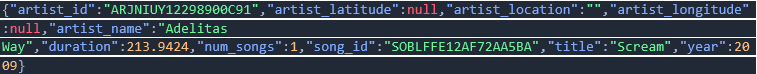

### B. song_data files contain the following columns:
1. artist_id
2. artist_latitude
3. artist_location
4. artist_longitude
5. artist_name
6. duration
7. num_songs
8. song_id
9. title
10. year

#### The image below is a screenshot of data in a song_data file:
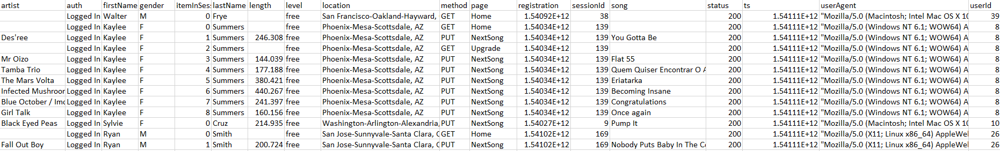

# Database Overview

## PostgreSQL on Amazon

#### The image below shows the Amazon data types available and their corresponsing PostgreSQL aliases:
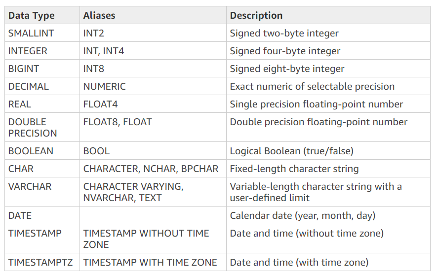

## Data Warehouse Schema

The Star Schema will be used, where there will one fact table that is accompanies with a set of dimensional tables. The schema can be easily understood by business users and is optimized for querying large data sets.

The image below is a visual diagram of the tables included in the schema:
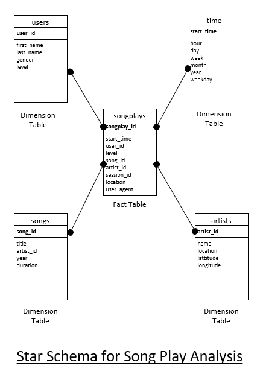

## Database Tables

### Staging Tables: Prepares raw data to be transformed and loaded into schema

#### a) staging_events_table

| col_name      | data_type | key     | 
|---------------|-----------|---------|
| id            | int       | primary |
| artist        | varchar   | -       |
| auth          | varchar   | -       |
| firstname     | varchar   | -       |
| gender        | char      | -       |
| iteminsession | int       | -       |
| lastname      | varchar   | -       |
| length        | double.P  | -       |
| level         | varchar   | -       |
| location      | varchar   | -       |
| method        | varchar   | -       |
| page          | varchar   | -       |
| registration  | bigint    | -       |
| sessionid     | int       | -       |
| song          | varchar   | -       |
| status        | int       | -       |
| ts            | bigint    | -       |
| useragent     | varchar   | -       |
| userId        | int       | -       |

#### Sample:
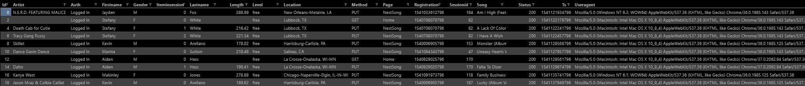

#### b) staging_songs_table

| col_name        | data_type | key     |
|-----------------|-----------|---------|
| artist_id       | varchar   | primary |
| artist_latitude | double.P  | -       |
| artist_location | varchar   | -       |
| artist_longitude| double.P  | -       |
| artist_name     | varchar   | -       |
| duration        | double.P  | -       |
| num_songs       | int       | -       |
| song_id         | varchar   | -       |
| title           | varchar   | -       |
| year            | int       | -       |

#### Sample:
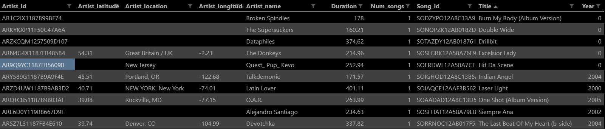

### Fact Table: Contains business events recorded in quantifiable values

#### songplay_table

| col_name      | data_type | key     | 
|---------------|-----------|---------|
| songplay_id   | int       | primary |
| start_time    | timestamp | -       |
| user_id       | int       | -       |
| level         | varchar   | -       |
| song_id       | varchar   | -       |
| artist_id     | varchar   | -       |
| session_id    | varchar   | -       |
| location      | varchar   | -       |
| user_agent    | varchar   | -       |

#### Sample:
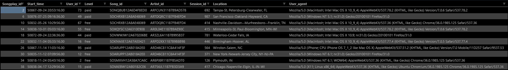

## Dimensional Tables: Contains context of business events recorded as attributes

#### a) user_table

| col_name      | data_type | key     | 
|---------------|-----------|---------|
| user_id       | int       | primary |
| first_name    | varchar   | -       |
| last_name     | varchar   | -       |
| gender        | char      | -       |
| level         | varchar   | -       |

#### Sample:
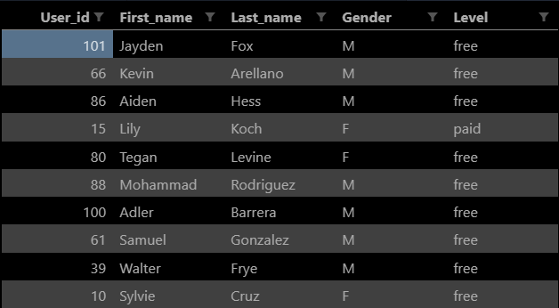

#### b) song_table

| col_name      | data_type | key     | 
|---------------|-----------|---------|
| song_id       | varchar   | primary |
| title         | varchar   | -       |
| artist_id     | varchar   | -       |
| year          | int       | -       |
| duration      | double.P  | -       |

#### Sample:
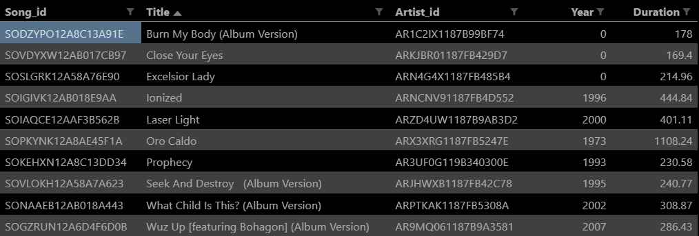

#### c) artist_table

| col_name      | data_type | key     | 
|---------------|-----------|---------|
| artist_id     | varchar   | primary |
| name          | varchar   | -       |
| location      | varchar   | -       |
| latitude      | double.P  | -       |
| longitude     | double.P  | -       |

#### Sample:
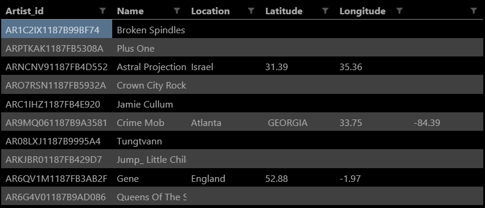

#### d) time_table

| col_name      | data_type | key     | 
|---------------|-----------|---------|
| start_time    | timestamp | primary |
| hour          | int       | -       |
| day           | int       | -       |
| week          | int       | -       |
| month         | int       | -       |
| year          | int       | -       |
| weekday       | int       | -       |

#### Sample:
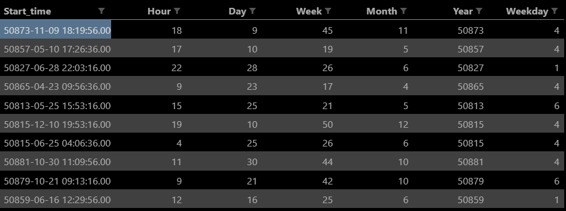

# Project Overview

## Built With

* [Amazon Redshift](https://aws.amazon.com/redshift/) - The database used
* [Amazon S3](https://aws.amazon.com/s3/) - Data used
* [Python](https://www.python.org/) - Programming language

## Authors

* **Jobelle Lee** - [themaxermister](https://github.com/themaxermister/Data-Warehouse)
